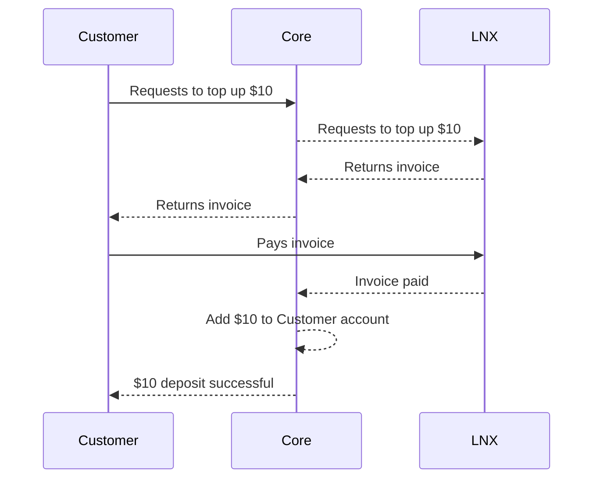
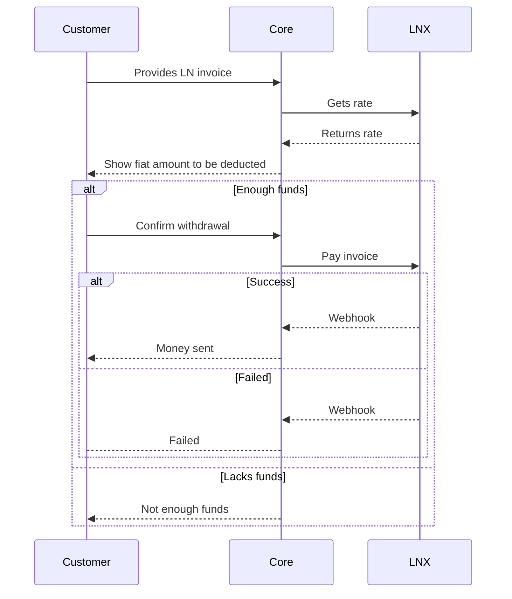
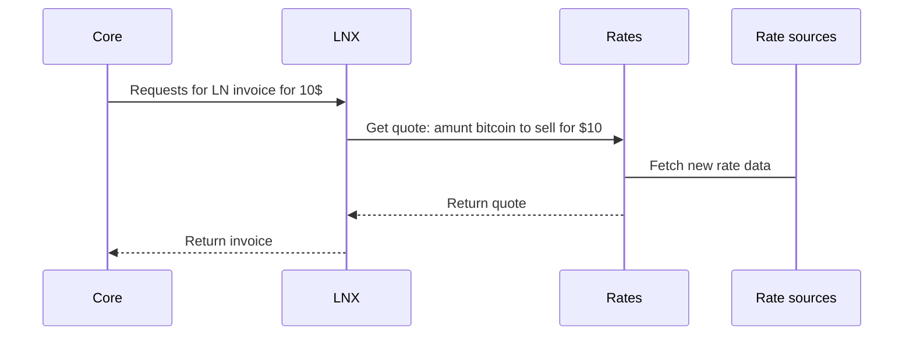

This document describes a business'/exchange's interactions with the LNX server. The two main functions are cash-in and cash-out.

## LNX's responsibilities

The LNX server is in charge of:

- knowing exchange rates
- setting timeouts for generated invoices to minimize volatility risk
- generating invoices given a currency and amount
- making Bitcoin/LN payments given a currency and amount
- detecting invoices paid (in and out) and notifying given webhook url

Below are diagrams for cashing in and out from an institution's point of view. LNX itself is composed of multiple software modules. We will dive into that detail in a later section.

## Cash-in

## Cash-out

# LNX Internals

As mentioned above, LNX is just a bunch of modules / services that allow it to buy and sell some asset against Bitcoin.

Here you'll find an example of the Customer (not shown), through Core, requesting for a Lightning Invoice in $ terms. LNX needs rates to make the right quote, because fundamentally LNX is a broker. It uses other exchanges downstream to fulfill orders.

These "Rate sources" could be configured to talk to Core again if the Core app already has that information.

# LNX non-technical operation

Although no longer in the domain of software, LNX requires banking relationships to maintain the operationas in the fiat side. If LNX mostly buys Bitcoin from Core because the main use of Bitcoin is for remittances back home, for example, then so that operation does not "run out" of fiat, that Bitcoin must be sold elsewhere, perhaps even abroad, and wire back fiat.

This is a business unto itself, and is beyond the scope of the LNX project.
