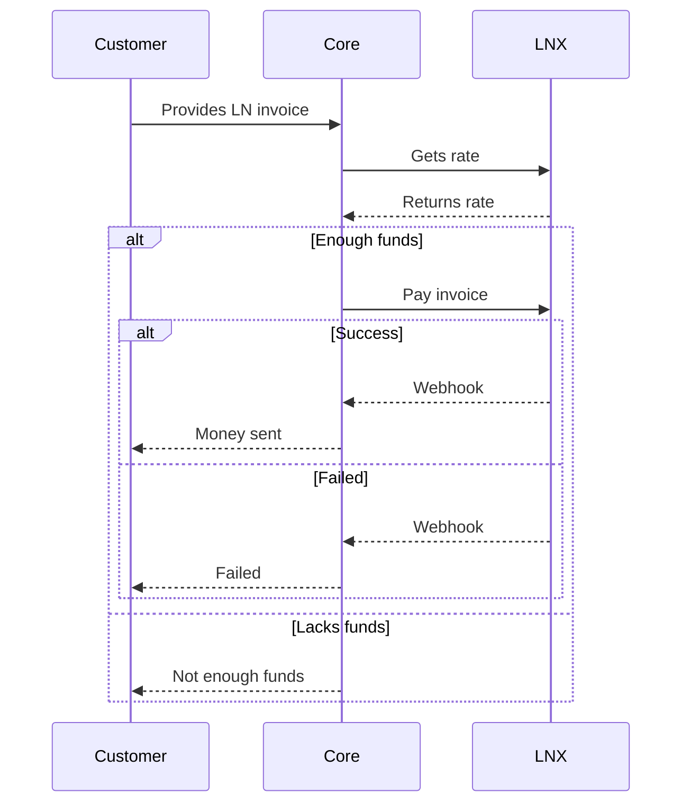
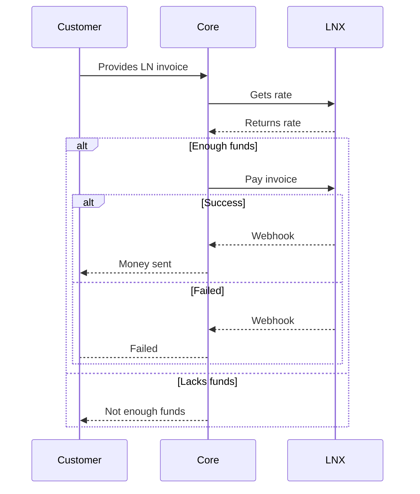

# Overview

## Cash-in

## Cash-out

# Fetching backend info

In order for the LN app to know what endpoints to hit, they go to `/.well-known/lnx.yml`. This file contains all necessary information to interact with the server, such as:

- authorization
- kyc, if needed
- where to create quotes
- get asset list and balances
