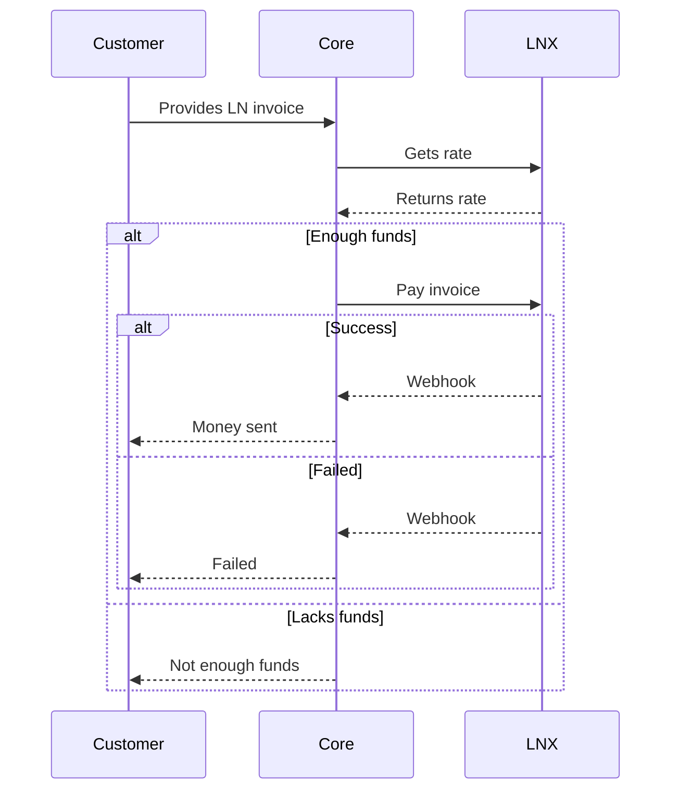
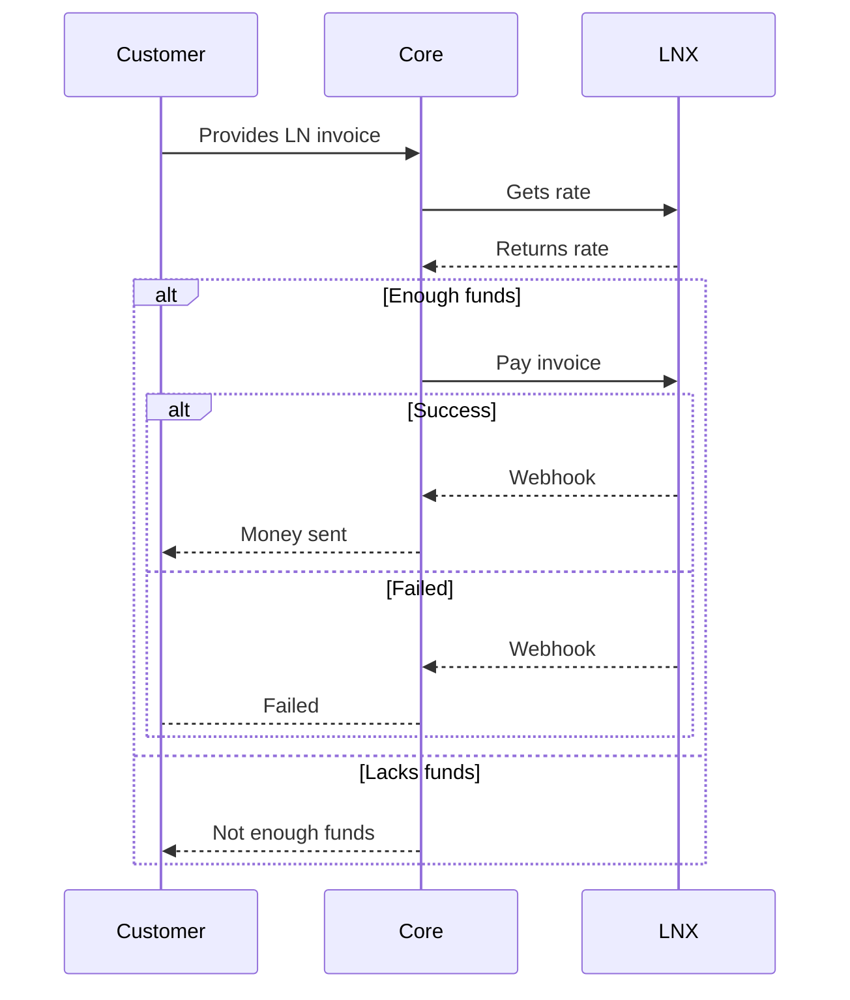

This document describes a business'/exchange's interactions with the LNX server. The two main functions are cash-in and cash-out.

## LNX's responsibilities

The LNX server is in charge of:

- knowing exchange rates
- setting timeouts for generated invoices to minimize volatility risk
- generating invoices given a currency and amount
- making Bitcoin/LN payments given a currency and amount
- detecting invoices paid (in and out) and notifying given webhook url

## Cash-in

## Cash-out

