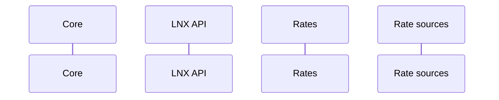

This document describes a business'/exchange's interactions with the LNX server. The two main functions are cash-in and cash-out.

## LNX's responsibilities

The LNX server is in charge of:

- knowing exchange rates
- setting timeouts for generated invoices to minimize volatility risk
- generating invoices given a currency and amount
- making Bitcoin/LN payments given a currency and amount
- detecting invoices paid (in and out) and notifying given webhook url

Below are diagrams for cashing in and out from an institution's point of view. LNX itself is composed of multiple software modules. We will dive into that detail in a later section.

## Cash-in

## Cash-out

# LNX Internals

As mentioned above, LNX is just a bunch of modules / services that allow it to buy and sell some asset against Bitcoin. 

