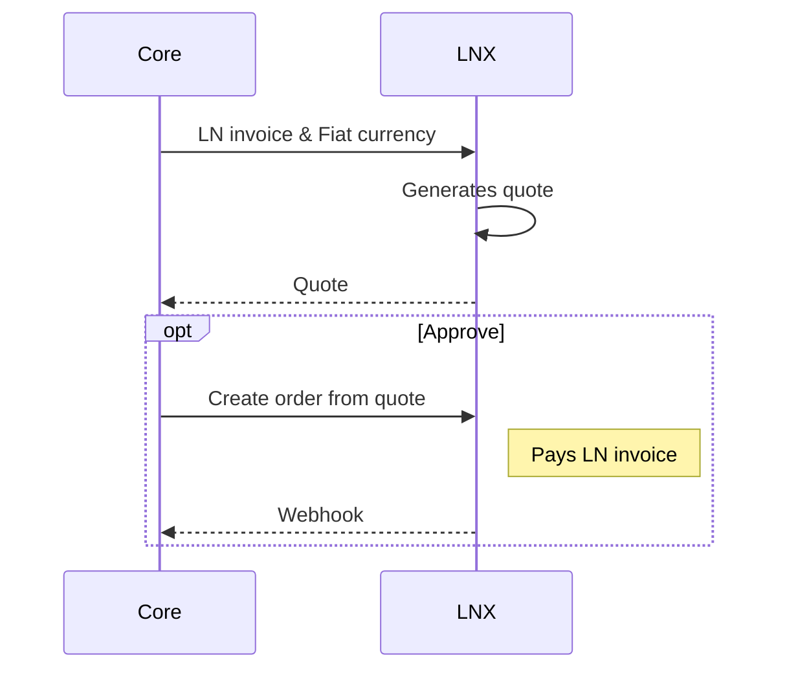
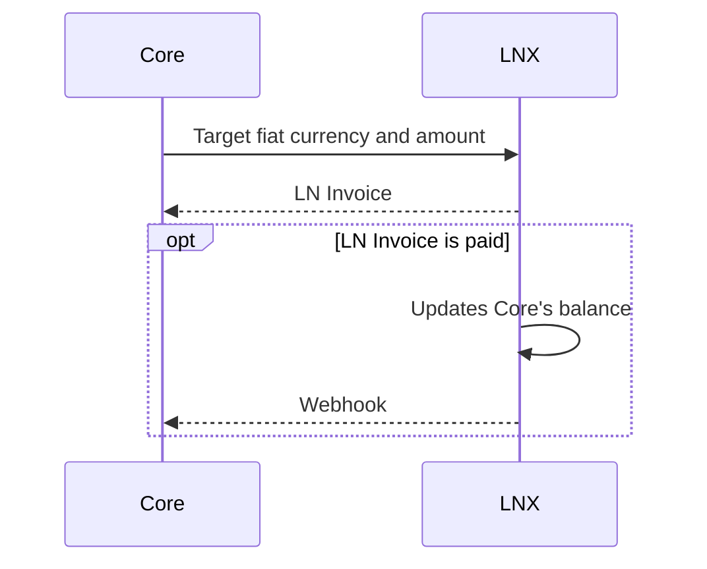

# endpoints

- create quote
  - fiat to btc: supply base currency and ln invoice, return quote id
  - btc to fiat: supply quote currency and amount, return ln invoice
- create order: supply quote id; only used when converting from fiat to btc

## Fiat to Bitcoin

When converting fiat to Bitcoin, the Lightning Invoice to pay must be supplied along with the currency that is being converted in order for LNX to get how much of that currency will be deducted from Core's balance.

## Bitcoin to Fiat

When converting Bitcoin to fiat, LNX must receive what fiat currency to convert to and the amount of that fiat currency to target. LNX returns an LN invoice, and no longer a quote record since the LN invoice **is** the quote.

## Balance

There is a simple ledger in LNX to keep track of the balance of Core. This is useful for reconciliation, especially if LNX is run by the same entity as Core.
