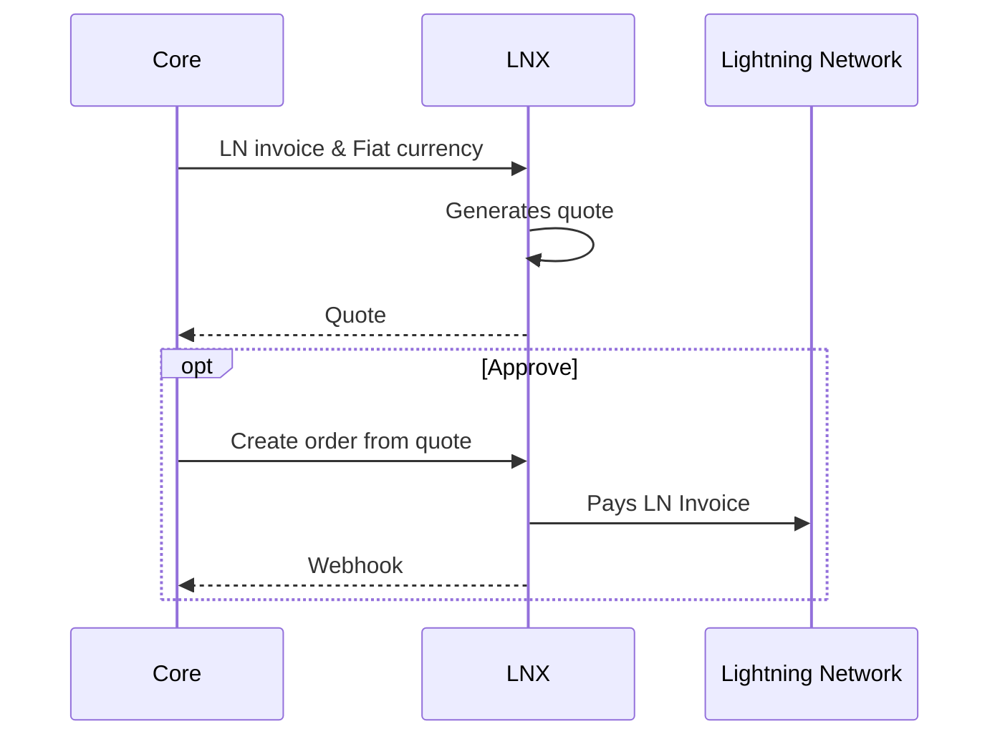
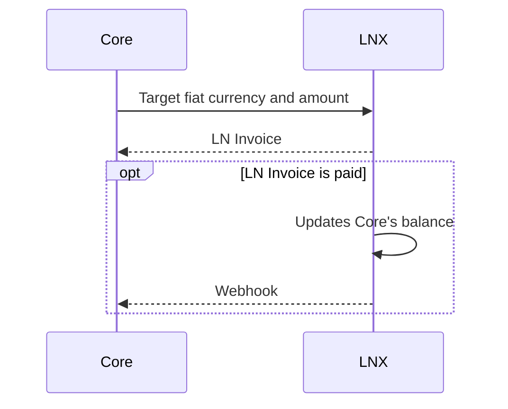

# Endpoints

- create quote
  - fiat to btc: supply base currency and ln invoice, return quote id
  - btc to fiat: supply quote currency and amount, return ln invoice
- create order: supply quote id; only used when converting from fiat to btc

## Fiat to Bitcoin

When converting fiat to Bitcoin, the Lightning Invoice to paid must be supplied along with the currency that is being converted. With this information, LNX will compute how much of that currency will be deducted from Core's balance.

## Bitcoin to Fiat

When converting Bitcoin to fiat, LNX must receive what fiat currency to convert to and the amount of that fiat currency to target. LNX returns an LN invoice, and no longer a quote record since the LN invoice **is** the quote.

## Balance

Because there is no real-time settlement in fiat that can be done with reasonable cost, a ledger is kept on LNX to keep track of Core's balance.

This is useful for reconciliation, whether or not LNX is run as the same entity as Core.
