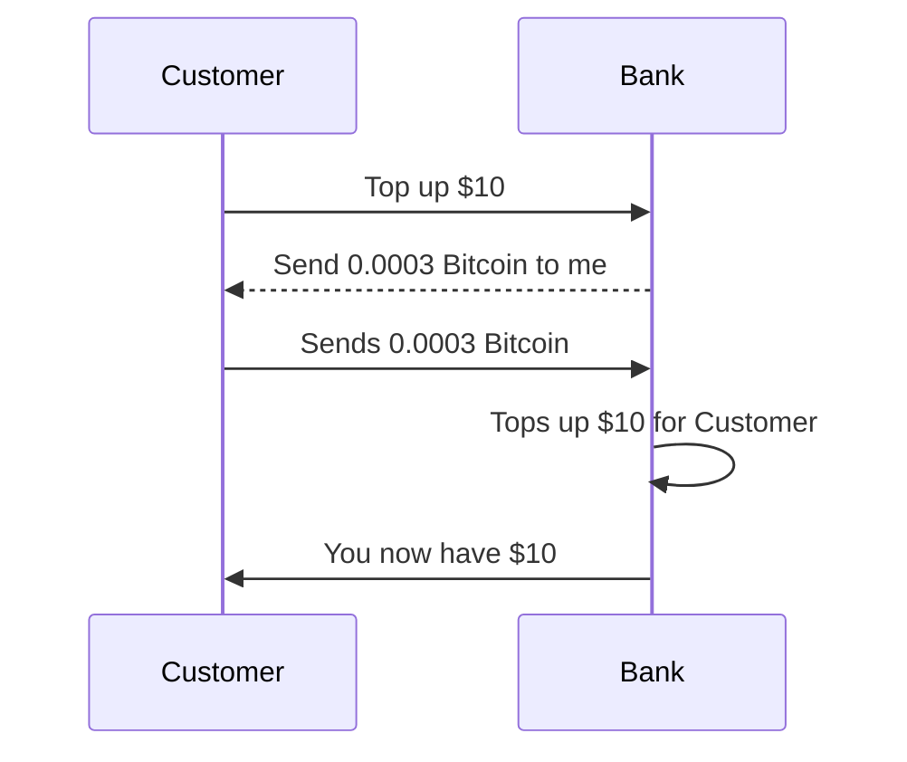
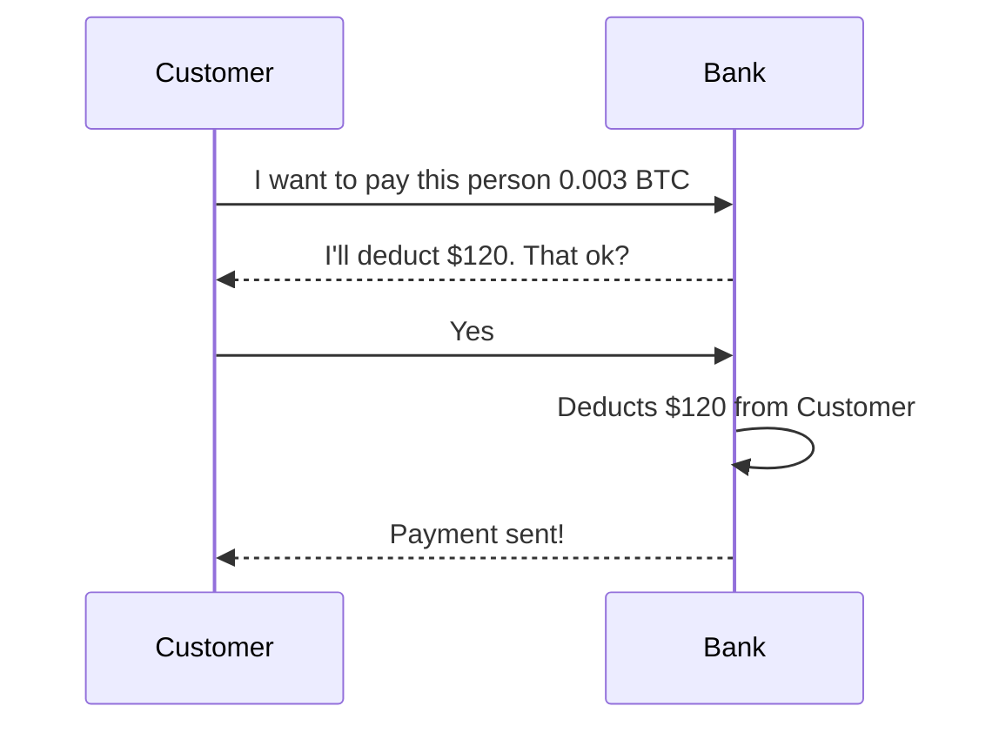
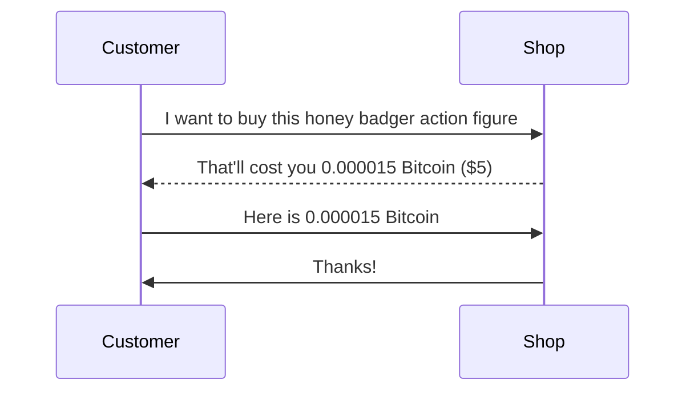

# Introduction

LNX ("links") is a set of standards and open source software which people/institutions (such as exchanges) can use to integrate with the Bitcoin and Lightning Network (LN). Its goal is to lower the barrier to entry for development teams for such integrations.

# Use Cases

There are multiple simple use cases. You'll notice that the examples given here are fundamentally buying and selling of Bitcoin for some other currency.

## Customer tops up fiat account

This is a simplified example of what happens when a customer tops up their $ account using Bitcoin.

## Customer sends fiat out as Bitcoin

A customer can send in Bitcoin and get fiat, but what happens if they want to pay someone that accepts Bitcoin?

## Customer pays for goods and services

# Other Standards

It may have some overlap with [tbDEX](https://github.com/TBD54566975/tbdex-whitepaper), but its objective is to make it easier for these exchanges to use Bitcoin + LN as a medium of exchange between currencies, and for financial institutions to talk to these exchanges. Though [tbDEX specs](https://github.com/TBD54566975/tbdex-protocol/blob/main/lib/README.md) are new and subject to sudden change, the goal is to eventually be compatible with tbDEX's messaging format. Until tbDEX's v1 specs are released, LNX will implement its own messaging format.

In short, LNX will eventually merely contain software that will behave as a drop-in modules for financial institutions to be with tbDEX compatible exchanges and vice versa.

# Definitions

To lessen confusion, we will use the following terms:

- **Financial Institution (FI)**: the entity that the customer is directly interacting with
- **Exchange**: the exchanges which LNX leverages to manage liquidity

From the point of view of the customer, LNX is the FI -- in fact, they will have no notion of LNX.

The FI, however, may choose to run LNX itself or contract a service provider to handle this for them.

# Flexible Levels of Integration

The level of integration is flexible: you may want to manage your own treasury, or you may want to just use LNX standards as a way to talk to other Bitcoin exchanges which will take care of that for you. An example of this is for a bank that wants to offer Bitcoin deposits over LN and have that appear as Philippine Pesos. They may not be ready to custody Bitcoin and run a Lightning node, and simply want to get their local fiat currency for Bitcoin sent over, or to get Bitcoin for fiat they are selling. In this scenario, a LNX service provider may run software and manage liquidity on the LN node.

On the other hand, an institution that is ready for this may run the whole gamut of software and standards, and even write the software libraries to connect to exchanges that LNX does not currently support.
